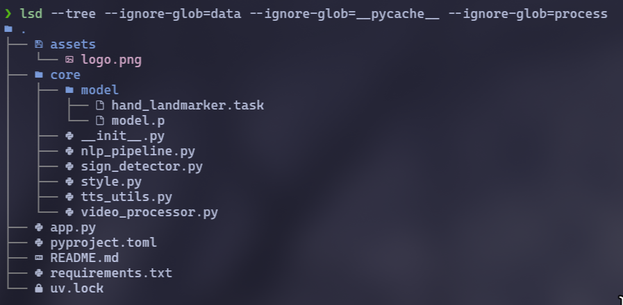

<p align="center">
  
</p>

<h1 align="center">অলীকবচন (Olikbochon)</h1>
<p align="center"><b>Bridging Communication — real-time sign-language fingerspelling into text and speech, in English and Bengali.</b></p>

<p align="center">
  
  
  
  
  
</p>

---

## Overview

**Olikbochon** (অলীকবচন) is a **Streamlit**-based real-time sign-language fingerspelling system that converts webcam hand gestures into readable, spell-corrected captions and, optionally, spoken audio in **English** or **Bengali**.

The project is organized as two complementary parts:

1. **Application runtime** (`app.py`, `core/`) — real-time inference, an editable letter buffer, captioning, translation, and speech synthesis.
2. **Data and model pipeline** (`process/`) — standalone scripts for dataset collection, dataset construction, and classifier training, allowing the bundled model to be reproduced or retrained from scratch.

The project is built entirely on free and open-source components: no paid APIs, no cloud ML services, and no API keys are required to run it.

---

## Architecture

```text
Webcam
  │
  ▼
streamlit-webrtc (video stream in-browser, over WebRTC)
  │
  ▼
Detection loop (recv() callback, per frame)
  │
  ├─ MediaPipe HandLandmarker → 21 hand keypoints per hand
  ├─ RandomForestClassifier (core/model/model.p) → predicted letter + confidence
  └─ Debounce + buffer logic → stable letter committed, logged with timestamp
  │
  ▼
Pause detection → word boundary inserted
  │
  ▼
Editable letter buffer (⟳ Load, manual add/edit/remove)
  │
  ▼
NLP pipeline
  ├─ pyspellchecker → corrected word/sentence (optional)
  └─ deep-translator → Bengali translation (optional)
  │
  ▼
gTTS → audio → custom player (play/pause, mute, seek) in-browser
```

---

## Preview

<p align="center">
  
</p>

---

## Features

- **Live camera feed** in the browser via `streamlit-webrtc` — a full-width, camera-first UI with a live caption bar drawn directly on the video frame.
- **Hand-landmark based fingerspelling recognition** — MediaPipe Tasks `HandLandmarker` (up to 2 hands) feeds a padded/trimmed landmark vector into a trained `RandomForestClassifier` that predicts one of 26 English letters (A–Z) per frame.
- **Stability-gated letter commit** — a letter is only added to the buffer once it has been held steady for a configurable number of frames, so a single sign isn't registered dozens of times per second.
- **Automatic word-boundary detection** — a pause with no hand in frame inserts a space, allowing full sentences in one continuous session.
- **Per-letter confidence logging** — every committed letter is logged with a timestamp and confidence score, viewable as a table in the UI.
- **Editable letter buffer** — camera detections load into an editable text field, where letters can be added, corrected, or removed by hand — or typed from scratch, camera-free.
- **Inline controls** — toggle Bengali translation, toggle auto-correct spelling, and choose the speech language, all directly under the video feed.
- **NLP post-processing** — whitespace normalization and, when enabled, word-by-word spell correction (`pyspellchecker`), then re-capitalized into a clean caption.
- **Bengali translation** — optional, one-click translation via `deep-translator`'s free `GoogleTranslator` wrapper (no API key required).
- **Text-to-speech with a custom player** — `gTTS`-synthesized audio played through a dark-themed player with play/pause, mute, and seek controls.
- **Minimal, modern dark UI** — custom CSS hides the default Streamlit chrome in favor of a dark, gradient, rounded-corner theme.
- **Reproducible model pipeline** — a dedicated `process/` directory covers dataset collection, dataset construction, and classifier training.
- **100% free/open-source stack** — no paid or metered third-party APIs anywhere in the pipeline.

---

## Project structure

```text
Olikbochon/
├── app.py
├── assets/
│   └── logo.png
├── images/
│   └── 260709_01h07m30s_screenshot.png
├── core/
│   ├── __init__.py
│   ├── data/
│   │   └── data.pickle
│   ├── model/
│   │   ├── hand_landmarker.task
│   │   └── model.p
│   ├── nlp_pipeline.py
│   ├── sign_detector.py
│   ├── style.py
│   ├── tts_utils.py
│   └── video_processor.py
├── process/
│   ├── collect_imgs.py
│   ├── create_dataset.py
│   ├── inference_classifier.py
│   ├── test_setup.py
│   ├── train_classifier.py
│   └── data/
│       └── 0 ... 25/            # 26 class-wise folders of training images
├── pyproject.toml
├── requirements.txt
├── uv.lock
└── README.md
```

| Module | Responsibility |
|---|---|
| `app.py` | Streamlit entry point — page setup, camera-first WebRTC layout, inline controls, editable letter buffer, output rendering |
| `core/sign_detector.py` | Hand-landmark extraction and model-inference bridge; also returns a confidence score |
| `core/video_processor.py` | Per-frame WebRTC callback — debounce logic, live caption overlay, thread-safe buffer and detection-log handling |
| `core/nlp_pipeline.py` | Text cleanup, optional spell correction, optional Bengali translation |
| `core/tts_utils.py` | gTTS audio generation, plus a hidden autoplay helper and a styled custom audio player |
| `core/style.py` | Custom Streamlit CSS / theme |
| `core/model/` `core/data/` | Trained classifier, MediaPipe model asset, and serialized training features |
| `process/*.py` | Dataset collection, dataset build, and classifier training — see below |

> All `process/` scripts use paths relative to `process/` itself (for example `./data`, `./model.p`). Run them with `process/` as the working directory.

---

## How it works

**1. Detection.** `core/sign_detector.py` loads the trained `RandomForestClassifier` (`core/model/model.p`) and MediaPipe's Tasks `HandLandmarker` (`core/model/hand_landmarker.task`, auto-downloaded on first run). For each frame it detects up to 2 hands, draws the 21-point skeleton, flattens landmark `(x, y)` coordinates into a feature vector padded/trimmed to `model.n_features_in_`, and predicts a letter via `LABELS_DICT`. When available, `predict_proba` also yields a confidence score.

**2. Buffering.** `core/video_processor.py` only commits a letter once it repeats for `STABLE_FRAMES = 15` consecutive frames (~0.5 s), preventing duplicate spam. After `RESET_FRAMES = 20` frames (~0.7 s) with no hand detected, a space is inserted as a word boundary. Each commit is logged with a timestamp and confidence score, guarded by a thread-safe lock since `recv()` runs on its own WebRTC thread.

**3. Editing.** The committed buffer can be loaded (via **⟳ Load**) into an editable text field — the actual source of truth for generation — so letters can be corrected, added, or removed by hand, or typed directly without the camera.

**4. NLP.** `core/nlp_pipeline.py` lower-cases and normalizes whitespace, optionally spell-corrects word-by-word with `pyspellchecker` (skipped if **Auto-correct spelling** is off), capitalizes the result, and optionally translates it to Bengali via `deep-translator`. A failed translation falls back to a visible "Translation unavailable" message instead of crashing the app.

**5. Speech.** `core/tts_utils.py` synthesizes the caption to MP3 with `gTTS` and renders it through `custom_audio_player_html` — a small dark-themed player (play/pause, mute, seek) mounted via `st.components.v1.html`, since Streamlit's `st.markdown` doesn't execute embedded `<script>` tags.

---

## Data and training pipeline

The `process/` directory offline-regenerates the bundled classifier. Run its scripts from inside `process/`:

```bash
cd process
python collect_imgs.py       # 26 classes x 100 images -> process/data/<class_id>/
python create_dataset.py     # landmark extraction (legacy mediapipe.solutions.hands) -> process/data.pickle
python train_classifier.py   # RandomForestClassifier, 80/20 split -> process/model.p, prints test accuracy

# promote the new artifacts into the runtime app's expected paths
cp model.p ../core/model/model.p
cp data.pickle ../core/data/data.pickle
```

Use `python inference_classifier.py` for a standalone, OpenCV-window sanity check, or `python test_setup.py` to confirm `opencv-python`, `mediapipe`, and `scikit-learn` import correctly.

> **Extra dependency:** `create_dataset.py` imports `matplotlib`, which isn't listed in `requirements.txt`/`pyproject.toml` — install it separately.
>
> **GUI requirement:** `collect_imgs.py` and `inference_classifier.py` call `cv2.imshow`, which needs a GUI-capable OpenCV build; the project's pinned `opencv-python-headless` doesn't support it, so install regular `opencv-python` to run them.
>
> **Feature-extraction mismatch:** `create_dataset.py` uses the legacy `mediapipe.solutions.hands` API, while runtime `core/sign_detector.py` uses the newer Tasks `HandLandmarker` API. Both produce 21 `(x, y)` landmarks per hand, but keep the difference in mind when extending the pipeline.

---

## Installation

**Requirements:** Python 3.11+ (pinned via `.python-version`), a webcam, and a WebRTC-capable browser (Chrome, Edge, Firefox). Internet access is needed on first run (to download `hand_landmarker.task`) and for Bengali translation/speech synthesis. No API keys are required.

```bash
git clone https://github.com/miskatul-anwar/Olikbochon.git
cd Olikbochon

python -m venv .venv
source .venv/bin/activate      # Windows: .venv\Scripts\activate
pip install -r requirements.txt
```

Or with [`uv`](https://github.com/astral-sh/uv):

```bash
git clone https://github.com/miskatul-anwar/Olikbochon.git
cd Olikbochon
uv sync
```

---

## Running the app

```bash
streamlit run app.py
```

Streamlit prints a local URL (typically `http://localhost:8501`). Open it, grant camera permission when prompted, and click **Start** under the video panel.

---

## Usage guide

1. **Start the camera.** Click **Start** below the video panel.
2. **Fingerspell letters.** Hold each hand shape steady for about half a second; the live caption bar shows what's been captured so far.
3. **Pause between words.** Briefly drop your hand out of frame to insert a word boundary.
4. **Set your options.** Toggle **Translate to Bengali**, toggle **Auto-correct spelling**, and choose a speech language.
5. **Load and edit the buffer.** Click **⟳ Load** to pull camera-detected letters into the editable **Edit Buffer** field — type, backspace, or paste to add or fix letters; this field is what actually gets processed.
6. **Generate.** Click **Generate** to normalize, optionally spell-correct, optionally translate, and synthesize speech.
7. **Review.** The caption (and Bengali translation, if enabled) appears in the **Detected Caption** card, with the custom audio player below. Expand **"Show raw detected letters"** for a per-letter table with timestamp and confidence.
8. **Start over.** Click **Clear Buffer** to reset everything.

---

## Configuration

| Setting | Location | Default | Purpose |
|---|---|---|---|
| `STABLE_FRAMES` | `core/video_processor.py` | `15` | Frames a letter must hold steady before commit |
| `RESET_FRAMES` | `core/video_processor.py` | `20` | Frames with no hand before inserting a word boundary |
| `MODEL_URL` | `core/sign_detector.py` | Google's hosted `hand_landmarker` (float16) | Fallback download for `hand_landmarker.task` |
| `RTC_CONFIGURATION` | `app.py` | Public Google STUN server | WebRTC connectivity; add a TURN server for restrictive networks |

No API keys are required — translation and speech synthesis both use free, unauthenticated endpoints.

---

## Technologies used

| Category | Library | Purpose |
|---|---|---|
| Web app / UI | [`streamlit`](https://streamlit.io/), [`streamlit-webrtc`](https://github.com/whitphx/streamlit-webrtc), [`av`](https://github.com/PyAV-Org/PyAV) | App framework, browser webcam streaming, video frame I/O |
| Computer vision | [`opencv-python-headless`](https://github.com/opencv/opencv-python), [`mediapipe`](https://developers.google.com/mediapipe), [`numpy`](https://numpy.org/) | Frame drawing, hand-landmark detection, feature vectors |
| Tabular data | [`pandas`](https://pandas.pydata.org/) | Rendering the per-letter detection log as a table |
| ML classifier | [`scikit-learn`](https://scikit-learn.org/) | `RandomForestClassifier` training and inference |
| Language | [`pyspellchecker`](https://github.com/barrust/pyspellchecker), [`deep-translator`](https://github.com/nidhaloff/deep-translator) | Spelling correction, English-to-Bengali translation |
| Speech | [`gTTS`](https://github.com/pndurang/gTTS) | Free MP3 speech synthesis |
| Training only | [`matplotlib`](https://matplotlib.org/) | Imported by `process/create_dataset.py`; not pinned as a dependency |

---

## Troubleshooting

- **Camera doesn't start / black video panel.** Confirm browser camera permission; `streamlit-webrtc` requires HTTPS or `localhost`.
- **Connection fails when deployed remotely.** The app only configures a public STUN server by default; add a TURN server to `RTC_CONFIGURATION` in `app.py`.
- **"No letters to work with yet."** Click **⟳ Load** first, or type letters directly into the Edit Buffer.
- **No audio plays.** Browsers often block autoplay with sound; use the custom player's play button.

---

## Known limitations

- Fingerspelled English alphabet only — no full ASL/BdSL word signs, numbers, or dynamic gestures.
- Camera-only input; no path for processing an uploaded video file.
- Spell correction is a simple per-word dictionary lookup, with no grammar- or context-aware correction.
- The `process/` training pipeline writes its outputs locally and requires a manual copy step into `core/model/` and `core/data/`.

---

## License

A `LICENSE` file is not currently present in this repository, so no explicit open-source license terms are defined. If you intend to distribute or reuse this project, add a `LICENSE` file (for example, MIT or Apache-2.0) to clarify usage rights.