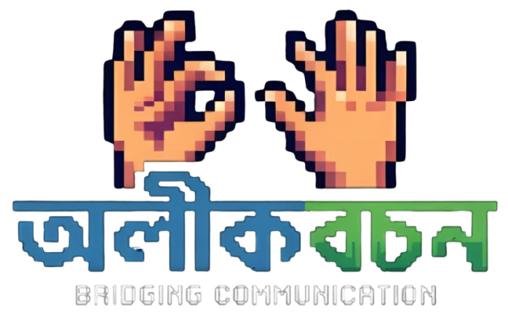

# অলীকবচন (Olikbochon)
Real-time fingerspelled sign language recognition that turns hand gestures into spoken words — in both English and Bengali.

Olikbochon watches a live camera feed, reads fingerspelled letters through a trained hand-landmark model, assembles them into words and sentences, corrects spelling, translates to Bengali when needed, and speaks the result out loud. The entire app runs as a single Streamlit process. There is no JavaScript frontend, no Node build step, and no paid API in the pipeline.

---

## Why It Exists

Most sign language tools either need a native mobile app, a paid cloud vision API, or a browser-based JS stack that's a pain to deploy on a low-resource machine. Olikbochon strips that down to one Python process: a webcam feed goes in, a classifier reads the hand shape frame by frame, and the app narrates the result. Everything — detection, spelling correction, translation, and speech synthesis — is free and open-source.

---

## Core Features

- **Live camera feed** through `streamlit-webrtc`, rendered full-width with a camera-first layout
- **Unmodified detection core** — MediaPipe's HandLandmarker feeds a trained `RandomForestClassifier` (`model.p`), preserving the original inference logic exactly as it was validated during training
- **Debounced buffering** — a letter is only committed once the hand holds that shape for roughly half a second, so the buffer doesn't fill with 30 duplicate predictions per second
- **Pause-based word boundaries** — dropping your hand out of frame for about 0.7 seconds inserts a space, letting you fingerspell full sentences without a manual "next word" button
- **Spelling correction** — raw fingerspelled output is cleaned up with `pyspellchecker` before anything is displayed
- **Bengali translation** — handled by `deep-translator`, which needs no API key
- **Text-to-speech output** — generated with `gTTS` and autoplayed directly in the browser
- **Minimal custom UI** — hidden Streamlit chrome, custom CSS, and YouTube-style captions instead of a stock dashboard look

---

## How the Data Was Built

The classifier at the center of this app didn't come from a public dataset — it was trained from scratch on hand landmark data collected specifically for fingerspelled letters.

**Collection.** Frames were captured from a webcam for each letter class, one gesture held steadily for a batch of frames per session. Multiple short sessions were recorded per letter to capture natural variation in hand angle, distance from camera, and lighting.

**Landmark extraction.** Instead of feeding raw pixels into a classifier, every frame was passed through MediaPipe's HandLandmarker, which returns 21 3D keypoints per detected hand. Those coordinates — not the image itself — became the feature vector. This keeps the model small, fast, and independent of background or skin tone, since it only ever sees geometry.

**Cleaning and mapping.** Frames where MediaPipe failed to detect a hand, or returned landmarks with an obviously broken geometry (from motion blur or a hand leaving the frame mid-capture), were dropped before labeling. The remaining landmark sets were mapped to their corresponding letter labels and compiled into a single training table.

**Training.** The labeled landmark data was used to train a `RandomForestClassifier` from scikit-learn. Random forests handle this kind of tabular, moderate-dimensionality data well, train fast on modest hardware, and don't require a GPU — which matters for a project meant to run on a normal laptop. The trained model is serialized to `model.p` and loaded directly by the detection module at runtime, with its original label-decoding logic left untouched.

---

## Architecture

Olikbochon is intentionally monolithic. There's one Streamlit process, and everything downstream of the camera feed is plain Python.

```
Webcam
  │
  ▼
streamlit-webrtc (video stream in-browser, over WebRTC)
  │
  ▼
Detection loop (recv() callback, per frame)
  │
  ├─ MediaPipe HandLandmarker → 21 hand keypoints
  ├─ RandomForestClassifier (model.p) → predicted letter
  └─ Debounce + buffer logic → stable letter committed
  │
  ▼
Pause detection → word boundary inserted
  │
  ▼
NLP pipeline
  ├─ pyspellchecker → corrected word/sentence
  └─ deep-translator → Bengali translation (optional)
  │
  ▼
gTTS → audio → autoplayed in-browser
```

### Technology Stack

| Layer | Tool |
|---|---|
| Web frontend | Streamlit |
| Live video | `streamlit-webrtc`, `av` |
| Hand tracking | MediaPipe (HandLandmarker) |
| Classification | scikit-learn (`RandomForestClassifier`) |
| Numerical ops | NumPy |
| Computer vision | OpenCV (headless) |
| Spelling correction | `pyspellchecker` |
| Translation | `deep-translator` |
| Speech synthesis | `gTTS` |

No React, no Vue, no bundler, no separate API server. The browser only exists to run the WebRTC video stream and render Streamlit's own components.

---

## Project Structure

```
Olikbochon/
├── app.py                  # Streamlit entry point — layout, UI, session state
├── core/                   # Detection and inference logic
│   ├── sign_detector.py    # MediaPipe + RandomForest inference (kept unchanged)
│   └── video_processor.py  # WebRTC VideoProcessorBase, debounce/buffer logic
├── process/                # Post-detection pipeline
│   ├── nlp_pipeline.py     # Word boundaries, spell-check, translation
│   └── tts_utils.py        # gTTS synthesis + base64 autoplay helper
├── assets/
│   └── logo.png
├── model.p                 # Trained RandomForestClassifier
├── hand_landmarker.task    # MediaPipe hand landmark model
├── pyproject.toml
├── requirements.txt
└── uv.lock
```

---

## Setup and Installation

### Prerequisites

- Python 3.10 or newer (check `.python-version` in the repo for the exact pinned version)
- A working webcam
- `pip`, or `uv` if you prefer faster dependency resolution

### 1. Clone the repository

```bash
git clone https://github.com/miskatul-anwar/Olikbochon.git
cd Olikbochon
```

### 2. Create a virtual environment

Using standard `venv`:

```bash
python -m venv .venv
source .venv/bin/activate      # on Windows: .venv\Scripts\activate
```

Or, if you have `uv` installed and want to use the committed lockfile directly:

```bash
uv sync
```

### 3. Install dependencies

```bash
pip install -r requirements.txt
```

This pulls in Streamlit, `streamlit-webrtc`, MediaPipe, OpenCV, scikit-learn, `pyspellchecker`, `deep-translator`, and `gTTS`. No API keys are required for any of them.

---

## Usage

Start the app from the project root:

```bash
streamlit run app.py
```

Streamlit will print a local URL, usually `http://localhost:8501`. Open it, grant camera permission when prompted, and click **Start**.

**Basic flow:**

1. Hold a fingerspelled letter steady in front of the camera until it registers — the buffer only commits a letter once it's been stable for about half a second, so there's no need to rush.
2. Drop your hand out of frame briefly between words. A pause of roughly 0.7 seconds inserts a space automatically.
3. Once you've fingerspelled your phrase, trigger the output step in the UI. The buffered letters run through spell-checking, get translated to Bengali if that option is on, and are synthesized into speech.
4. The corrected caption appears on screen, alongside the Bengali translation if enabled, with the generated audio playing automatically.

---

## Deployment Notes

If you're deploying to something like Streamlit Community Cloud, or any environment behind a NAT or firewall, be aware that WebRTC needs a way to negotiate a connection across networks:

- A public STUN server is already wired into `RTC_CONFIGURATION` in `app.py`, which covers most standard deployments.
- If you're running behind a stricter corporate network or a NAT that STUN can't traverse, you'll need to add a TURN server to that same configuration.

---

## Contributing

Issues and pull requests are welcome. If you're extending the detection model — adding new gestures, retraining on a larger dataset, or swapping in a different classifier — keep the existing landmark-based approach in mind: it's what keeps this project lightweight enough to run without a GPU.

## License

Check the repository for license details before reuse or redistribution.
